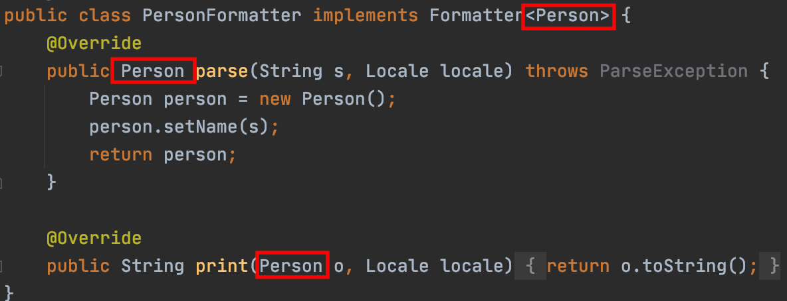

# 스프링부트 스프링MVC 설정
 

## Formatter
 
- Printer: 해당 객체를 (Locale 정보를 참고하) 문자열로 어떻게 출력할 것인가
- Parser: 어떤 문자열을 (Locate 정보를 참고하여) 객체로 어떻게 변환할 것인가

## Formatter vs Converter
Convertet는 Formatter보다 좀 더 General한 용도로 쓰임. 
자바 객체를 다른 자바 객체로 변환한다던가.. 
하지만 주로 문자열을 객체로 변환한다던가 객체를 문자열로 변환하는 것을 많이 사용하기 때문에 
Converter보다는 Formatter를 주로 많이 사용.  

  
